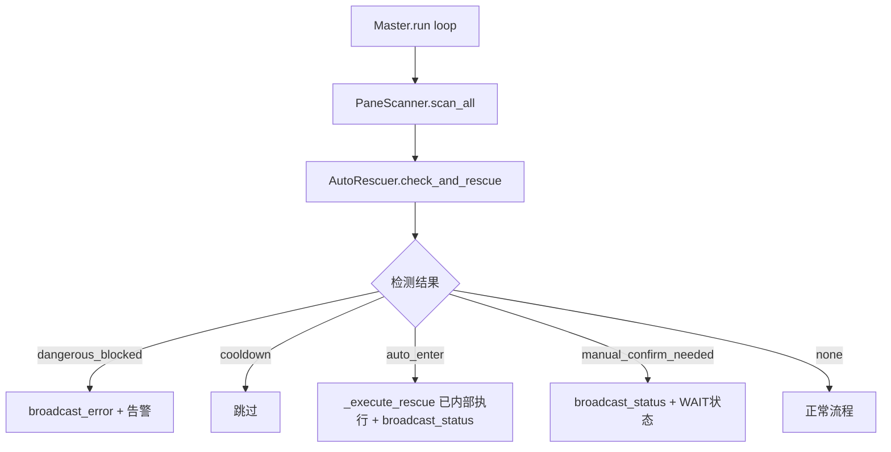
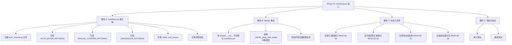
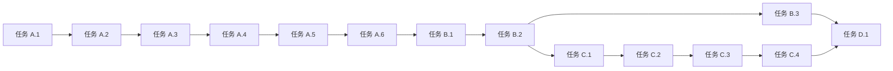

# 功能规划：Phase 24 - Master 自动救援核心

**规划时间**：2026-02-04
**预估工作量**：18 任务点
**关联里程碑**：v1.86 - 主控自动救援闭环 + 状态汇总表

---

## 1. 功能概述

### 1.1 目标

实现 Master 自动判断 WAIT/confirm/press-enter 等交互式提示状态，并执行安全的自动确认（发送 Enter）。通过独立封装 `AutoRescuer` 类，替换并增强现有 `_handle_pane_wait_states()` 逻辑。

### 1.2 范围

**包含**：
- 创建独立 `AutoRescuer` 类（封装模式检测、危险检测、冷却机制）
- 替换 Master 的 `_handle_pane_wait_states()` 内部逻辑
- 危险操作立即告警（不执行自动确认）
- 状态汇总表输出（window/state/task_id/note）

**不包含**：
- Worker 端的状态上报修改
- 手动确认的交互界面

### 1.3 技术约束

- 遵循现有 `master.py` 代码风格
- 使用 `window_name` 一致化（而非 pane_id）
- 混合模式匹配：关键词列表 + 正则表达式
- 冷却机制：每 window_name 独立时间戳
- 危险检测黑名单优先于模式检测

---

## 2. 技术方案

### 2.1 类设计

```python
class AutoRescuer:
    """
    自动救援器：检测交互提示并安全自动确认

    职责：
    1. 检测 pane 输出中的等待提示模式
    2. 危险操作黑名单检查
    3. 冷却时间管理（每 window 独立）
    4. 执行自动确认（发送 Enter）
    5. 替换 _handle_pane_wait_states() 的内部逻辑
    """

    # =====================================
    # 模式分类（严格优先级）
    # =====================================

    # 立即自动 Enter（安全类型）
    AUTO_ENTER_PATTERNS = [
        # [Pp]ress [Ee]nter / [Hh]it [Rr]eturn / 按回车 / 回车继续
        (r'[Pp]ress [Ee]nter|[Pp]ress [Rr]eturn|[Hh]it [Ee]nter|按[回车键]?继续|回车继续', 1),
    ]

    # 需手动确认（返回 manual_confirm_needed）
    MANUAL_CONFIRM_PATTERNS = [
        # y/n 交互
        (r'\[y[\/\]n\]|\[Y[\/\]n\]|\(y[\/\]n\)|y or n|y\/n', 2),
        # 确认提示
        (r'[Cc]onfirm|[Aa]re you sure|确认|确定吗', 3),
        # 继续/执行提示
        (r'[Cc]ontinue|[Pp]roceed|[Yy]es[/\s]?[Nn]o|ok to proceed', 4),
    ]

    # 危险操作黑名单（检测到立即告警，不执行自动确认）
    DANGEROUS_PATTERNS = [
        r'rm\s+-rf',           # 强制删除目录
        r'rm\s+-r',            # 递归删除
        r'shred',              # 粉碎文件
        r'DROP\s+(DATABASE|TABLE|INDEX)',  # 数据库删除
        r'TRUNCATE',           # 清空表
    ]

    def __init__(
        self,
        tmux_manager=None,
        cooling_time: float = 30.0,
        broadcaster=None,
        dry_run: bool = False
    ):
        """
        初始化 AutoRescuer

        Args:
            tmux_manager: tmux 操作管理器（用于 send-keys）
            cooling_time: 冷却时间（秒），默认 30s
            broadcaster: StatusBroadcaster 实例（用于日志记录）
            dry_run: 干跑模式（不实际执行 send-keys）
        """
        self.tmux = tmux_manager
        self.cooling_time = cooling_time
        self.broadcaster = broadcaster or StatusBroadcaster(worker_id='master')
        self.dry_run = dry_run

        # 每 window 冷却跟踪 {window_name: last_rescue_timestamp}
        self._cooldown: Dict[str, float] = {}

        # 统计信息
        self._stats = {
            'total_checks': 0,
            'total_rescues': 0,
            'manual_confirms': 0,
            'dangerous_blocked': 0,
            'cooldown_skipped': 0,
        }

    def check_and_rescue(
        self,
        pane_output: str,
        window_name: str,
        session_name: str
    ) -> tuple[bool, str, str]:
        """
        检测 pane 输出并执行自动救援

        Args:
            pane_output: pane 的文本内容
            window_name: window 名称（用于查找和冷却）
            session_name: tmux session 名称

        Returns:
            (should_rescue, action, pattern): 是否执行救援、执行动作、检测到的模式
                - should_rescue: bool - 是否需要执行动作
                - action: str - 'auto_enter' | 'manual_confirm' | 'none'
                - pattern: str - 检测到的模式文本
        """
        self._stats['total_checks'] += 1

        # Step 0: 空内容检查
        if not pane_output or not pane_output.strip():
            return False, 'none', ''

        # Step 1: 危险模式检测（最高优先级，立即告警）
        if self._is_dangerous(pane_output):
            self._stats['dangerous_blocked'] += 1
            self.broadcaster.broadcast_error(
                task_id='',
                message=f'Dangerous pattern detected in {window_name}, blocking auto-rescue',
                meta={'window_name': window_name, 'action': 'blocked'}
            )
            return False, 'dangerous_blocked', self._match_dangerous(pane_output)

        # Step 2: 自动 Enter 模式检测（最高优先级-可自动）
        pattern = self._detect_pattern(pane_output, self.AUTO_ENTER_PATTERNS)
        if pattern:
            if self._is_in_cooldown(window_name):
                self._stats['cooldown_skipped'] += 1
                return False, 'cooldown', pattern

            success = self._execute_rescue(window_name, session_name)
            if success:
                self._update_cooldown(window_name)
                self._stats['total_rescues'] += 1
                self.broadcaster.broadcast_status(
                    worker_id='master',
                    task_id='',
                    state='RUNNING',
                    message=f'Auto-rescued {window_name}: detected "{pattern}"'
                )
                return True, 'auto_enter', pattern
            return False, 'rescue_failed', pattern

        # Step 3: 手动确认模式检测（返回 manual_confirm_needed）
        pattern = self._detect_pattern(pane_output, self.MANUAL_CONFIRM_PATTERNS)
        if pattern:
            self._stats['manual_confirms'] += 1
            self.broadcaster.broadcast_status(
                worker_id='master',
                task_id='',
                state='WAIT',
                message=f'Manual confirm needed {window_name}: "{pattern}"'
            )
            return False, 'manual_confirm_needed', pattern

        # Step 4: 无匹配
        return False, 'none', ''

    def _is_dangerous(self, content: str) -> bool:
        """检测危险模式"""
        for pattern in self.DANGEROUS_PATTERNS:
            if re.search(pattern, content, re.IGNORECASE):
                return True
        return False

    def _match_dangerous(self, content: str) -> str:
        """返回匹配到的危险模式"""
        for pattern in self.DANGEROUS_PATTERNS:
            match = re.search(pattern, content, re.IGNORECASE)
            if match:
                return match.group(0)
        return ''

    def _detect_pattern(self, content: str, pattern_list: list) -> Optional[str]:
        """从列表中检测模式"""
        for pattern, _ in pattern_list:
            match = re.search(pattern, content, re.IGNORECASE)
            if match:
                return match.group(0)
        return None

    def _is_in_cooldown(self, window_name: str) -> bool:
        """检查是否在冷却期"""
        now = time.time()
        last_time = self._cooldown.get(window_name, 0)
        return (now - last_time) < self.cooling_time

    def _update_cooldown(self, window_name: str) -> None:
        """更新冷却时间戳"""
        self._cooldown[window_name] = time.time()

    def _execute_rescue(self, window_name: str, session_name: str) -> bool:
        """执行自动确认（发送 Enter）"""
        if self.dry_run:
            print(f'[AutoRescuer] [DRY-RUN] Would send Enter to {window_name}')
            return True

        if not self.tmux:
            return False

        try:
            # 使用 window_name 直接传递，无需二次查找
            # TmuxCollaboration.send_keys_to_window(session_name, window_index, '')
            # 但我们直接用 window_name 查找对应的 index
            windows = self.tmux.list_windows(session_name)
            for w in windows:
                if w['name'] == window_name:
                    self.tmux.send_keys_to_window(session_name, w['index'], '')
                    return True
            return False
        except Exception:
            return False

    def get_stats(self) -> dict:
        """获取统计信息"""
        return self._stats.copy()

    def reset_stats(self) -> None:
        """重置统计信息"""
        self._stats = {
            'total_checks': 0,
            'total_rescues': 0,
            'manual_confirms': 0,
            'dangerous_blocked': 0,
            'cooldown_skipped': 0,
        }
```

### 2.2 集成架构



### 2.3 替换 vs 移除

- **替换**：`_handle_pane_wait_states()` 内部的 WaitDetector 检测逻辑
- **保留**：`PaneScanner`、`status_broadcaster`、`tmux_manager` 等基础设施
- **移除**：原有的并行 WaitDetector 检测机制

---

## 3. WBS 任务分解

### 3.1 任务结构图



---

### 模块 A：AutoRescuer 类实现（10 任务点）

**文件**: `swarm/auto_rescuer.py`

- [ ] **任务 A.1**：创建 `swarm/auto_rescuer.py` 文件结构（2 点）
  - **输入**：现有 `master.py` 代码风格参考
  - **输出**：`swarm/auto_rescuer.py` 文件，包含基础类框架
  - **关键步骤**：
    1. 创建文件，添加 docstring 和版权声明
    2. 定义 `AutoRescuer` 类骨架（`__init__`, `check_and_rescue`）
    3. 添加类型注解（`from typing import Dict, Optional, Tuple`）
    4. 创建统计信息字典结构

  - **验证**：
    - 文件存在且语法正确（`python -m py_compile swarm/auto_rescuer.py`）
    - 类可以实例化（`python -c "from swarm.auto_rescuer import AutoRescuer; print('OK')"`）

- [ ] **任务 A.2**：实现 `AUTO_ENTER_PATTERNS` 和检测方法（2 点）
  - **输入**：`claude_auto_rescue.sh` 中的 "press enter" 类型模式
  - **输出**：`AUTO_ENTER_PATTERNS` 常量和 `_detect_pattern()` 方法
  - **关键步骤**：
    1. 定义 `AUTO_ENTER_PATTERNS`（仅 press enter 类型）
    2. 实现 `_detect_pattern(content, pattern_list)` 方法
    3. 处理大小写不敏感匹配（`re.IGNORECASE`）
    4. 返回匹配到的文本片段

  - **验证**：
    - `[Pp]ress [Ee]nter` 检测为 "Press Enter"
    - `按回车继续` 检测为 "按回车继续"
    - `y/n` 模式不匹配（应由 MANUAL_CONFIRM 处理）

- [ ] **任务 A.3**：实现 `MANUAL_CONFIRM_PATTERNS`（2 点）
  - **输入**：需要手动确认的交互提示类型
  - **输出**：`MANUAL_CONFIRM_PATTERNS` 常量
  - **关键步骤**：
    1. 定义 `[y/n]` 交互模式
    2. 定义 `[C]onfirm` 确认模式
    3. 定义 `[C]ontinue` 继续模式
    4. 这些模式返回 `'manual_confirm_needed'` 而非自动 Enter

  - **验证**：
    - `[y/n]` 返回 `manual_confirm_needed`
    - `Continue?` 返回 `manual_confirm_needed`

- [ ] **任务 A.4**：实现 `DANGEROUS_PATTERNS`（2 点）
  - **输入**：`claude_auto_rescue.sh` 中的危险模式
  - **输出**：`DANGEROUS_PATTERNS` 常量和 `_is_dangerous()` 方法
  - **关键步骤**：
    1. 定义危险模式列表（rm -rf, rm -r, shred, DROP, TRUNCATE）
    2. **移除**：`> /dev/null` 和 `sudo`（过于敏感）
    3. 实现 `_is_dangerous()` 方法
    4. 实现 `_match_dangerous()` 返回匹配内容

  - **验证**：
    - `rm -rf` 检测为 True
    - `DROP TABLE` 检测为 True
    - `sudo rm` 检测为 False（sudo 不在黑名单中）
    - `> /dev/null` 检测为 False（不在黑名单中）

- [ ] **任务 A.5**：实现 `check_and_rescue` 核心方法（2 点）
  - **输入**：任务 A.2-A.4 的方法
  - **输出**：完整的 `check_and_rescue()` 返回 `(bool, str, str)` 元组
  - **关键步骤**：
    1. 空内容检查（`not pane_output or not pane_output.strip()`）
    2. 危险检测优先检查
    3. AUTO_ENTER 模式检测 → 执行救援（内部调用 `_execute_rescue`）
    4. MANUAL_CONFIRM 模式检测 → 返回 manual_confirm_needed
    5. 无匹配返回 none
    6. 更新统计信息

  - **验证**：
    - 危险内容返回 `(False, 'dangerous_blocked', 'rm -rf')`
    - 无匹配返回 `(False, 'none', '')`
    - 在冷却期返回 `(False, 'cooldown', pattern)`
    - 正常救援返回 `(True, 'auto_enter', 'Press Enter')`
    - 手动确认返回 `(False, 'manual_confirm_needed', '[y/n]')`

- [ ] **任务 A.6**：实现冷却机制（使用 window_name）（1 点）
  - **输入**：现有 `_last_auto_enter` 字典设计
  - **输出**：`{window_name: timestamp}` 结构和相关方法
  - **关键步骤**：
    1. 在 `__init__` 中初始化 `_cooldown: Dict[str, float] = {}`
    2. 实现 `_is_in_cooldown(window_name)` 方法
    3. 实现 `_update_cooldown(window_name)` 方法
    4. 使用 `time.time()` 获取时间戳

  - **验证**：
    - 冷却时间内调用返回 True
    - 冷却时间外调用返回 False

---

### 模块 B：Master 集成（4 任务点）

**文件**: `swarm/master.py`

- [ ] **任务 B.1**：导入并实例化 AutoRescuer（1 点）
  - **输入**：`swarm/auto_rescuer.py` 模块
  - **输出**：Master 类的 `__init__` 中初始化 `self.auto_rescuer`
  - **关键步骤**：
    1. 添加 `from swarm.auto_rescuer import AutoRescuer`
    2. 在 `__init__` 中实例化 `self.auto_rescuer`
    3. 传入 `tmux_manager`、`broadcaster` 等依赖

  - **验证**：
    - Master 实例包含 `auto_rescuer` 属性

- [ ] **任务 B.2**：替换 `_handle_pane_wait_states` 内部逻辑（2 点）
  - **输入**：现有 `_handle_pane_wait_states()` 和 WaitDetector 逻辑
  - **输出**：使用 `AutoRescuer.check_and_rescue()` 替换内部检测
  - **关键步骤**：
    1. 遍历 `PaneScanner.scan_all()` 返回的 `{window_name: content}`
    2. 对每个 window 调用 `self.auto_rescuer.check_and_rescue()`
       - **注意**：`check_and_rescue()` 内部已调用 `_execute_rescue()` 执行发送 Enter
    3. 根据返回的 action 进行处理：
       - `auto_enter`: 记录日志（救援已由 check_and_rescue 内部完成）
       - `manual_confirm_needed`: 设置 WAIT 状态并记录日志
       - `dangerous_blocked`: 触发告警
       - `cooldown`: 跳过并记录日志
    4. **移除**原有的并行 WaitDetector 检测机制

  - **重要**：Master 不应再次调用 `_execute_rescue()`，`check_and_rescue()` 已内部完成

  - **验证**：
    - 主循环正确使用 AutoRescuer
    - 不存在两套并行的检测机制
    - 不会重复发送 Enter

- [ ] **任务 B.3**：添加环境变量配置支持（1 点）
  - **输入**：`ENV_*` 配置模式
  - **输出**：支持 `AI_SWARM_AUTO_RESCUE_COOLING` 环境变量
  - **关键步骤**：
    1. 定义 `ENV_AUTO_RESCUE_COOLING = 'AI_SWARM_AUTO_RESCUE_COOLING'`
    2. 在 `AutoRescuer.__init__` 中读取环境变量
    3. 支持 `AI_SWARM_AUTO_RESCUE_DRY_RUN` 干跑模式

  - **验证**：
    - 环境变量可覆盖默认值

---

### 模块 C：状态汇总表（3 任务点，输出到 stdout / 日志，非 UI/WEB）

**文件**: `swarm/master.py`

- [ ] **任务 C.1**：实现汇总表格式 `RESCUE-05`（1 点）
  - **输入**：v1.86 里程碑要求
  - **输出**：汇总表输出格式定义
  - **关键步骤**：
    1. 定义输出格式：`window | state | task_id | note`
    2. 示例：
       ```
       WINDOW         STATE    TASK_ID    NOTE
       ─────────────────────────────────────────
       commander      RUNNING  task_001   指挥官主窗口
       worker-01      WAIT     task_002   等待确认
       worker-02      ERROR    -          [DANGEROUS] rm -rf detected
       ```

  - **验证**：
    - 表格格式正确对齐

- [ ] **任务 C.2**：对齐指挥官汇报格式 `RESCUE-06`（1 点）
  - **输入**："指挥官汇报格式" 规范
  - **输出**：符合规范的汇报风格
  - **关键步骤**：
    1. 使用 `-` 表示 N/A 值
    2. 使用方括号标注特殊状态：`[DANGEROUS]`, `[WAIT]`
    3. 简洁明了的状态描述

  - **验证**：
    - 输出符合指挥官汇报规范

- [ ] **任务 C.3**：实现状态优先级 `RESCUE-07`（0.5 点）
  - **输入**：四状态优先级要求
  - **输出**：优先级排序逻辑
  - **关键步骤**：
    1. 定义优先级：ERROR > WAIT > RUNNING > DONE/IDLE
    2. 汇总表按此顺序排序

- [ ] **任务 C.4**：实现输出格式化 `RESCUE-08`（0.5 点）
  - **输入**：汇总表数据
  - **输出**：格式化的表格字符串
  - **关键步骤**：
    1. 实现 `_format_summary_table()` 方法
    2. 在每次 scan 周期后输出汇总表

  - **验证**：
    - 表格正确显示所有 window 状态

---

### 模块 D：测试与验证（1 任务点）

- [ ] **任务 D.1**：基本功能验证（1 点）
  - **输入**：所有任务完成
  - **输出**：功能完整可用
  - **关键步骤**：
    1. 运行 `python -c "from swarm.auto_rescuer import AutoRescuer; print('Import OK')"`
    2. 运行 `python -c "from swarm.master import Master; print('Master Import OK')"`
    3. 检查语法错误

  - **验证**：
    - 所有模块正确导入
    - 无语法错误

---

## 4. 依赖关系

### 4.1 依赖图



### 4.2 依赖说明

| 任务 | 依赖于 | 原因 |
|------|--------|------|
| A.2-A.6 | A.1 | 需要先创建文件结构 |
| B.1 | A.6 | 需要 AutoRescuer 类完成 |
| B.2 | B.1 | 需要实例化后调用 |
| B.2 | A.5 | 需要 check_and_rescue 方法 |
| C.1-C.4 | B.2 | 需要 Master 集成完成 |
| D.1 | 所有前置任务 | 需要全部完成后验证 |

### 4.3 并行任务

- 任务 A.1-A.6（AutoRescuer 实现）顺序进行
- 任务 C.*（状态汇总表）可与 B.* 并行
- 任务 D.1 需等所有任务完成后

---

## 5. 实施建议

### 5.1 代码风格

| 需求 | 方案 | 理由 |
|------|------|------|
| 文件位置 | `swarm/auto_rescuer.py` | 与 `master.py`、`master_scanner.py` 同级 |
| 命名风格 | PascalCase 类名，snake_case 方法 | 遵循 PEP8 |
| 类型注解 | 完整类型注解 | 提高代码可维护性 |
| 日志记录 | 通过 `status_broadcaster` | 与现有架构一致 |

### 5.2 潜在风险

| 风险 | 影响 | 缓解措施 |
|------|------|----------|
| 误判危险模式 | 高 | 保守策略：宁可误报不漏报 |
| 重复发送 Enter | 高 | `check_and_rescue()` 内部执行，Master 不再次调用 |
| tmux 不可用 | 低 | 检查 `tmux_manager` 存在性 |
| y/n 误自动 Enter | 高 | 只对 press enter 类型自动处理 |

### 5.3 测试策略

**单元测试**（后续 Phase）：
- `AutoRescuer` 模式检测逻辑
- 冷却机制正确性
- 危险模式黑名单
- 模式分类正确性（AUTO vs MANUAL）

**集成测试**（后续 Phase）：
- Master 主循环集成
- 端到端自动救援流程
- 状态汇总表输出

---

## 6. 验收标准

功能完成需满足以下条件：

- [ ] `swarm/auto_rescuer.py` 文件创建并语法正确
- [ ] `AutoRescuer` 类可实例化
- [ ] `AUTO_ENTER_PATTERNS` 仅包含 press enter 类型
- [ ] `MANUAL_CONFIRM_PATTERNS` 包含 y/n、confirm、continue
- [ ] `DANGEROUS_PATTERNS` 仅包含 rm -rf, rm -r, shred, DROP, TRUNCATE
- [ ] `check_and_rescue()` 返回 `(bool, str, str)` 元组
- [ ] y/n 模式返回 `manual_confirm_needed` 而非自动 Enter
- [ ] 危险内容检测为 `dangerous_blocked`
- [ ] 冷却机制正常工作（30s/窗口）
- [ ] Master 正确集成 AutoRescuer
- [ ] `_handle_pane_wait_states` 使用 AutoRescuer 替换内部逻辑
- [ ] 状态汇总表输出格式正确
- [ ] 无 Python 语法错误
- [ ] 代码符合项目风格（使用类型注解，无 console.log）

---

## 7. 文件变更清单

| 文件 | 操作 | 说明 |
|------|------|------|
| `swarm/auto_rescuer.py` | 新建 | AutoRescuer 类实现 |
| `swarm/master.py` | 修改 | 集成 AutoRescuer，替换旧逻辑，添加汇总表 |
| `swarm/__init__.py` | 可能修改 | 导出 AutoRescuer（如需要） |

---

## 8. 关键修复总结

### 8.1 Pane ID vs Window Name
- **修复前**：混用 pane_id 和 window_name
- **修复后**：统一使用 `window_name`，从 `scan_all()` 返回的 key 直接获取

### 8.2 Dangerous Patterns
- **修复前**：`sudo`, `> /dev/null` 等过于敏感
- **修复后**：仅使用 `rm -rf`, `rm -r`, `shred`, `DROP`, `TRUNCATE`

### 8.3 Pattern 优先级
- **修复前**：y/n 也自动 Enter
- **修复后**：y/n、confirm、continue 返回 `manual_confirm_needed`

### 8.4 WaitDetector 逻辑
- **修复前**：与 `_handle_pane_wait_states()` 并行存在
- **修复后**：`AutoRescuer` 完全替换内部逻辑

### 8.5 Double Send 风险
- **修复前**：Master 可能再次调用 `_execute_rescue()`
- **修复后**：`check_and_rescue()` 内部执行，Master 仅记录日志和更新状态

### 8.6 状态汇总表
- **新增**：window/state/task_id/note 格式
- **新增**：ERROR > WAIT > RUNNING > DONE/IDLE 优先级
- **明确**：输出到 stdout / 日志，非 UI/WEB

---

## 9. 后续优化方向

Phase 25 可考虑的增强：
- UI 状态汇总表显示
- Webhooks 通知危险模式检测
- 自定义模式白名单
- 每窗口独立冷却时间配置
