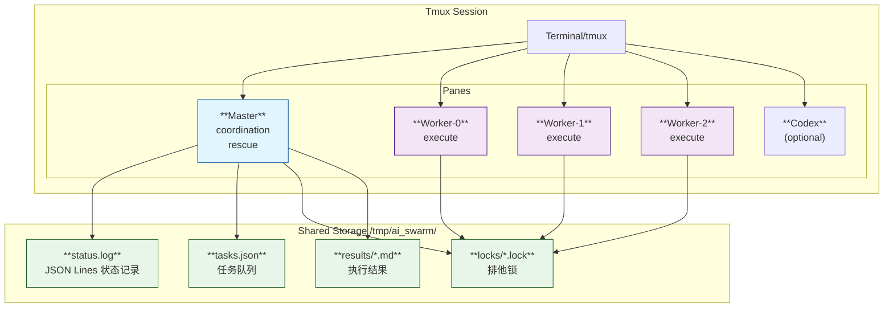
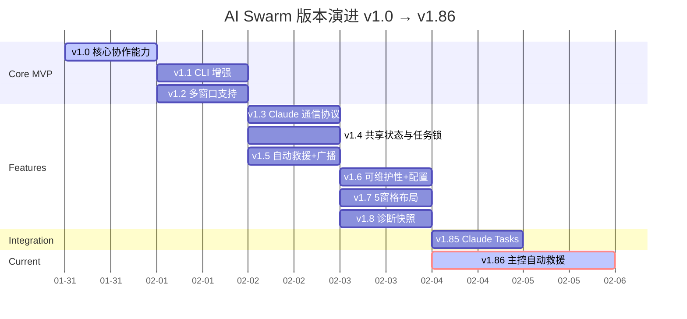
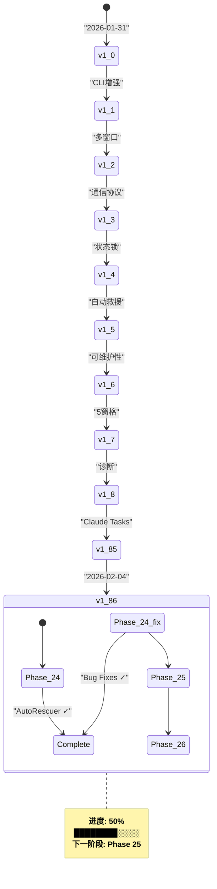
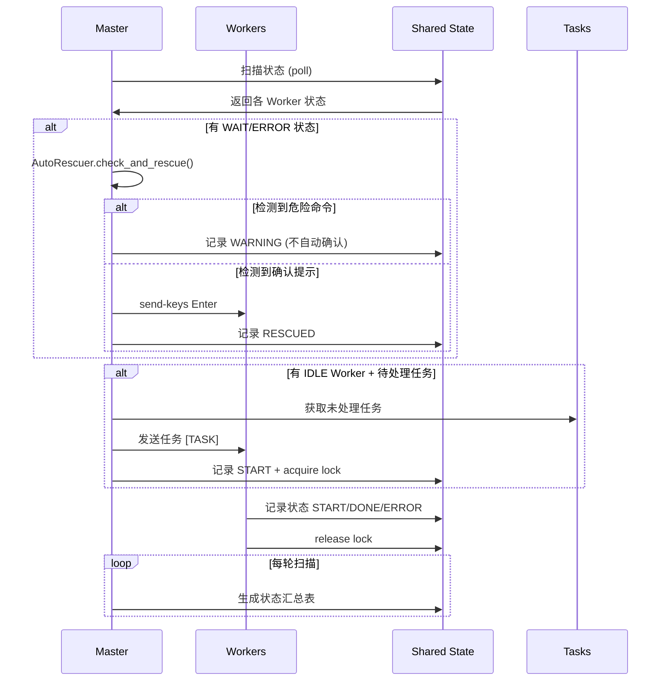
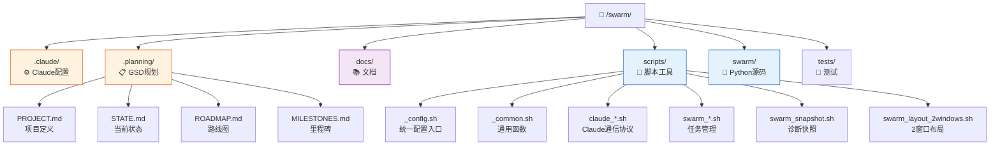
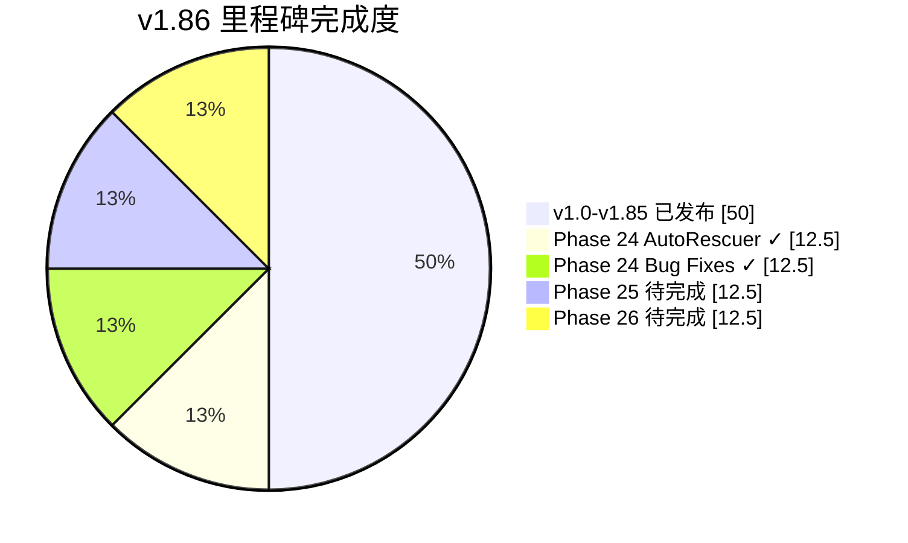
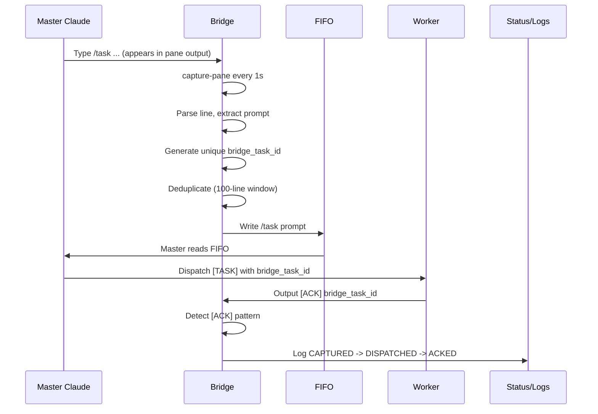
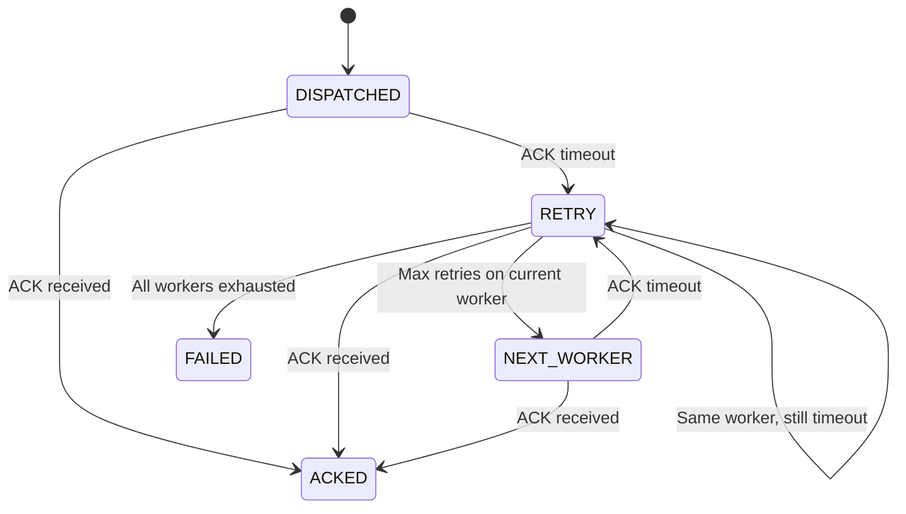

# AI Swarm 项目可视化图表

> 本文档使用 Mermaid 语法编写，支持 VS Code、GitHub、Obsidian 等平台自动渲染。
> 在线预览：https://mermaid.live/

---

## 1. 系统架构图



**渲染效果**：
- Master 协调者（蓝色）
- Worker 执行者（紫色）
- 共享存储（绿色）

---

## 2. 版本演进时间线



**说明**：
- 2026-01-31 到 2026-02-04：8天完成 v1.0 → v1.85
- 当前开发 v1.86：主控自动救援闭环

---

## 3. 当前进度状态机



---

## 4. Master/Worker 协作流程



---

## 5. 项目文件结构



---

## 6. 功能完成度



---

## 7. Claude Bridge Protocol (V1.93)

The Claude Bridge monitors the Master Claude Code window and dispatches tasks to workers with closed-loop verification.

### 7.1 Architecture Overview



### 7.2 Lifecycle Phases

| Phase | Description | Logged To |
|-------|-------------|-----------|
| CAPTURED | Task detected in master pane | bridge.log |
| PARSED | Task parsed and validated | bridge.log |
| DISPATCHED | Task written to FIFO | bridge.log + status.log |
| ACKED | Worker confirmed receipt | bridge.log |
| RETRY | ACK timeout, retrying | bridge.log |
| FAILED | All workers failed | bridge.log |

### 7.3 Bridge Task ID Format

```
bridge_task_id: br-{unix_timestamp_ns}-{3-char_random}
Example: br-1739999999123-abc
```

**Purpose:**
- Unique identifier for tracing task lifecycle
- Correlation between Bridge dispatch and Worker ACK
- Deduplication across multiple dispatch attempts

### 7.4 ACK Protocol

Workers must output `[ACK] <bridge_task_id>` pattern to confirm receipt:

```bash
# Worker receives task
[TASK] Please analyze PR #123

# Worker outputs ACK after processing begins
[ACK] br-1739999999123-abc
```

**ACK Detection:**
- Pattern configurable via `AI_SWARM_BRIDGE_ACK_TIMEOUT` (default: 10s)
- Bridge polls pane output looking for `[ACK]` pattern
- If timeout: trigger RETRY -> FAILOVER

### 7.5 Retry with Worker Failover



**Configuration:**
| Variable | Description | Default |
|----------|-------------|---------|
| `AI_SWARM_BRIDGE_MAX_RETRIES` | Max retries per worker | 3 |
| `AI_SWARM_BRIDGE_RETRY_DELAY` | Delay between retries | 2.0s |
| `AI_SWARM_BRIDGE_ACK_TIMEOUT` | Wait for ACK | 10.0s |

### 7.6 Structured Logging (bridge.log)

V1.93 uses JSON format for structured lifecycle tracking:

```json
{
  "ts": "2026-02-06T10:00:00.123Z",
  "phase": "DISPATCHED",
  "bridge_task_id": "br-1739999999123-abc",
  "task_preview": "Review PR #123",
  "target_worker": "%4",
  "attempt": 1,
  "latency_ms": 125
}
```

**Legacy Format (V1.92, still supported):**
```
[2026-02-06 10:00:00] dispatched to worker %4
```

### 7.7 Status Log Meta Fields (V1.93)

Bridge entries in `status.log` include:

```json
{
  "ts": "2026-02-06T10:00:00.123Z",
  "type": "HELP",
  "worker": "master",
  "task_id": null,
  "reason": "DISPATCHED: Review PR #123",
  "meta": {
    "type": "BRIDGE",
    "bridge_task_id": "br-1739999999123-abc",
    "target_worker": "%4",
    "attempt": 1,
    "dispatch_mode": "fifo"
  }
}
```

### 7.8 Observability Commands

```bash
# View recent bridge events
./scripts/swarm_bridge.sh bridge-status --recent 20

# Filter by phase/task/failure
./scripts/swarm_bridge.sh bridge-status --failed
./scripts/swarm_bridge.sh bridge-status --task br-123456
./scripts/swarm_bridge.sh bridge-status --phase DISPATCHED

# JSON output for automation
./scripts/swarm_bridge.sh bridge-status --json > /tmp/bridge_events.json

# Real-time dashboard
./scripts/swarm_bridge.sh bridge-dashboard --watch
```

### 7.9 Configuration Reference

| Variable | Required | Default | Description |
|----------|----------|---------|-------------|
| `AI_SWARM_BRIDGE_PANE` | Recommended | - | tmux pane_id (highest priority) |
| `AI_SWARM_BRIDGE_SESSION` | No | `swarm-claude-default` | tmux session name |
| `AI_SWARM_BRIDGE_WINDOW` | No | `codex-master` | tmux window name |
| `AI_SWARM_BRIDGE_LINES` | No | 200 | capture-pane line count |
| `AI_SWARM_BRIDGE_POLL_INTERVAL` | No | 1.0 | poll interval (seconds) |
| `AI_SWARM_BRIDGE_ACK_TIMEOUT` | No | 10.0 | ACK wait timeout |
| `AI_SWARM_BRIDGE_MAX_RETRIES` | No | 3 | max retries per worker |
| `AI_SWARM_BRIDGE_RETRY_DELAY` | No | 2.0 | retry delay (seconds) |
| `AI_SWARM_INTERACTIVE` | Yes | - | Must be `1` for FIFO |

---

## 8. 快速渲染

### VS Code
1. 安装 "Markdown Preview Mermaid Support"
2. 打开此文件
3. 右键 → "Open Preview"

### GitHub
直接提交此文件，自动渲染

### 在线预览
复制代码到 https://mermaid.live/

---

*Last updated: 2026-02-06 - v1.93 protocol added*
