# AI Swarm 项目可视化图表

> 本文档使用 Mermaid 语法编写，支持 VS Code、GitHub、Obsidian 等平台自动渲染。
> 在线预览：https://mermaid.live/

---

## 1. 系统架构图

```mermaid
graph TB
    subgraph "Tmux Session"
        TM[Terminal/tmux]
        subgraph "Panes"
            M["**Master**<br/>coordination<br/>rescue"]
            W0["**Worker-0**<br/>execute"]
            W1["**Worker-1**<br/>execute"]
            W2["**Worker-2**<br/>execute"]
            C["**Codex**<br/>(optional)"]
        end
    end

    subgraph "Shared Storage /tmp/ai_swarm/"
        S1["**status.log**<br/>JSON Lines 状态记录"]
        S2["**tasks.json**<br/>任务队列"]
        S3["**locks/*.lock**<br/>排他锁"]
        S4["**results/*.md**<br/>执行结果"]
    end

    TM --> M
    TM --> W0
    TM --> W1
    TM --> W2
    TM --> C

    M --> S1
    M --> S2
    M --> S3
    M --> S4
    W0 --> S3
    W1 --> S3
    W2 --> S3

    classDef master fill:#e1f5fe,stroke:#01579b
    classDef worker fill:#f3e5f5,stroke:#4a148c
    classDef storage fill:#e8f5e9,stroke:#1b5e20

    class M master
    class W0,W1,W2 worker
    class S1,S2,S3,S4 storage
```

**渲染效果**：
- Master 协调者（蓝色）
- Worker 执行者（紫色）
- 共享存储（绿色）

---

## 2. 版本演进时间线

```mermaid
gantt
    title AI Swarm 版本演进 v1.0 → v1.86
    dateFormat  YYYY-MM-DD
    axisFormat  %m-%d
    section Core MVP
    v1.0 核心协作能力    :active, v1_0, 2026-01-31, 1d
    v1.1 CLI 增强       :v1_1, 2026-02-01, 1d
    v1.2 多窗口支持     :v1_2, 2026-02-01, 1d
    section Features
    v1.3 Claude 通信协议 :v1_3, 2026-02-02, 1d
    v1.4 共享状态与任务锁: v1_4, 2026-02-02, 1d
    v1.5 自动救援+广播   :v1_5, 2026-02-02, 1d
    v1.6 可维护性+配置   :v1_6, 2026-02-03, 1d
    v1.7 5窗格布局      :v1_7, 2026-02-03, 1d
    v1.8 诊断快照       :v1_8, 2026-02-03, 1d
    section Integration
    v1.85 Claude Tasks   :v1_85, 2026-02-04, 1d
    section Current
    v1.86 主控自动救援   :crit, active, v1_86, 2026-02-04, 2d
```

**说明**：
- 2026-01-31 到 2026-02-04：8天完成 v1.0 → v1.85
- 当前开发 v1.86：主控自动救援闭环

---

## 3. 当前进度状态机

```mermaid
stateDiagram-v2
    [*] --> v1_0: "2026-01-31"
    v1_0 --> v1_1: "CLI增强"
    v1_1 --> v1_2: "多窗口"
    v1_2 --> v1_3: "通信协议"
    v1_3 --> v1_4: "状态锁"
    v1_4 --> v1_5: "自动救援"
    v1_5 --> v1_6: "可维护性"
    v1_6 --> v1_7: "5窗格"
    v1_7 --> v1_8: "诊断"
    v1_8 --> v1_85: "Claude Tasks"

    v1_85 --> v1_86: "2026-02-04"

    state v1_86 {
        [*] --> Phase_24
        Phase_24 --> Complete: "AutoRescuer ✓"
        Phase_24_fix --> Complete: "Bug Fixes ✓"
        Phase_24_fix --> Phase_25
        Phase_25 --> Phase_26
    }

    note right of v1_86
    **进度: 50%**
    ████████░░░░
    **下一阶段: Phase 25**
    end note
```

---

## 4. Master/Worker 协作流程

```mermaid
sequenceDiagram
    participant M as Master
    participant W as Workers
    participant S as Shared State
    participant T as Tasks

    M->>S: 扫描状态 (poll)
    S->>M: 返回各 Worker 状态

    alt 有 WAIT/ERROR 状态
        M->>M: AutoRescuer.check_and_rescue()
        alt 检测到危险命令
            M->>S: 记录 WARNING (不自动确认)
        else 检测到确认提示
            M->>W: send-keys Enter
            M->>S: 记录 RESCUED
        end
    end

    alt 有 IDLE Worker + 待处理任务
        M->>T: 获取未处理任务
        M->>W: 发送任务 [TASK]
        M->>S: 记录 START + acquire lock
    end

    W->>S: 记录状态 START/DONE/ERROR
    W->>S: release lock

    loop 每轮扫描
        M->>S: 生成状态汇总表
    end
```

---

## 5. 项目文件结构

```mermaid
graph TD
    ROOT["📁 /swarm/"]

    ROOT --> C1[".claude/<br/>⚙️ Claude配置"]
    ROOT --> C2[".planning/<br/>📋 GSD规划"]
    ROOT --> C3["docs/<br/>📚 文档"]
    ROOT --> C4["scripts/<br/>🔧 脚本工具"]
    ROOT --> C5["swarm/<br/>🐍 Python源码"]
    ROOT --> C6["tests/<br/>🧪 测试"]

    C4 --> S1["_config.sh<br/>统一配置入口"]
    C4 --> S2["_common.sh<br/>通用函数"]
    C4 --> S3["claude_*.sh<br/>Claude通信协议"]
    C4 --> S4["swarm_*.sh<br/>任务管理"]
    C4 --> S5["swarm_snapshot.sh<br/>诊断快照"]
    C4 --> S6["swarm_layout_5.sh<br/>5窗格布局"]

    C2 --> P1["PROJECT.md<br/>项目定义"]
    C2 --> P2["STATE.md<br/>当前状态"]
    C2 --> P3["ROADMAP.md<br/>路线图"]
    C2 --> P4["MILESTONES.md<br/>里程碑"]

    classDef config fill:#fff3e0,stroke:#e65100
    classDef core fill:#e3f2fd,stroke:#1565c0
    classDef docs fill:#f3e5f5,stroke:#7b1fa2

    class C1,C2 config
    class C4,C5 core
    class C3 docs
```

---

## 6. 功能完成度

```mermaid
pie showData
    title v1.86 里程碑完成度
    "v1.0-v1.85 已发布" : 50
    "Phase 24 AutoRescuer ✓" : 12.5
    "Phase 24 Bug Fixes ✓" : 12.5
    "Phase 25 待完成" : 12.5
    "Phase 26 待完成" : 12.5
```

---

## 快速渲染

### VS Code
1. 安装 "Markdown Preview Mermaid Support"
2. 打开此文件
3. 右键 → "Open Preview"

### GitHub
直接提交此文件，自动渲染

### 在线预览
复制代码到 https://mermaid.live/

---

*Last updated: 2026-02-04*
